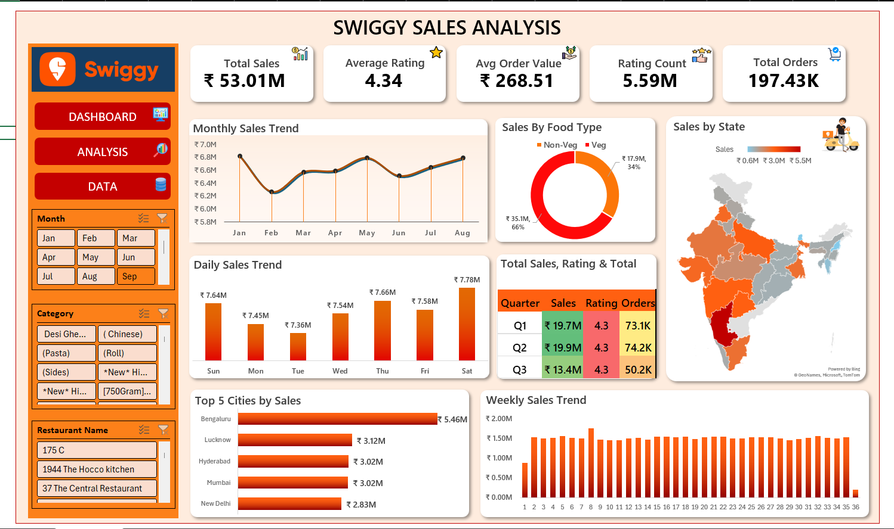
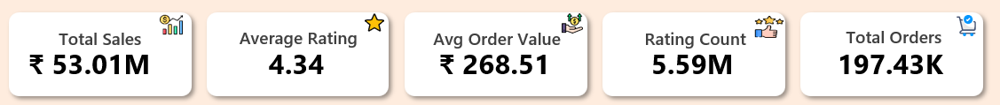
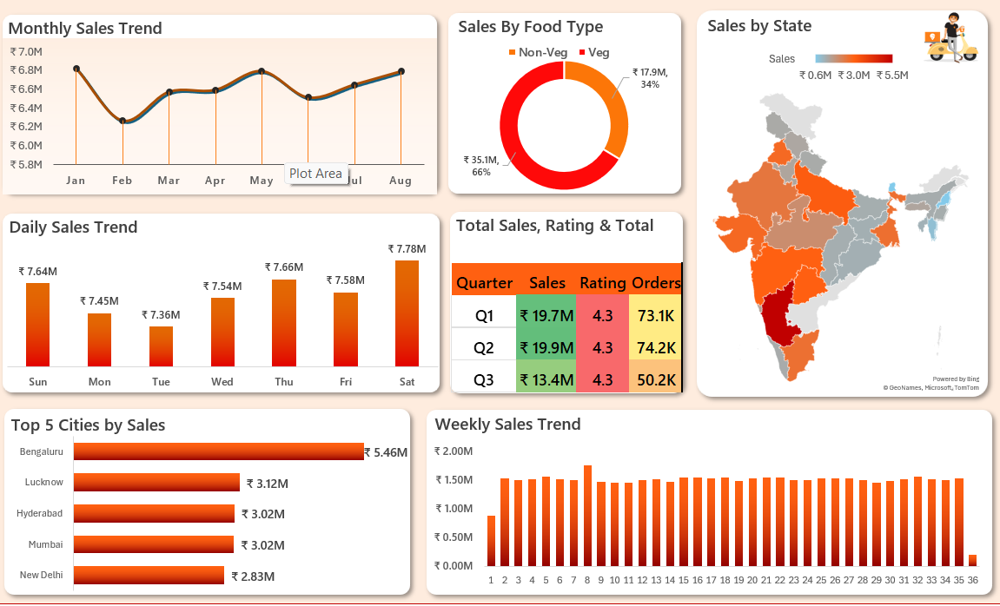

# 📊 Swiggy Sales Analysis

## 🔹 Overview
This project analyzes Swiggy sales data to understand customer behavior, sales trends, and overall business performance.  
The dashboard is built using Microsoft Excel with interactive navigation between Dashboard, Analysis, and Data sheets.

---

## 🔹 Features
- KPI Cards (Total Sales, Orders, Average Rating)
- Monthly, Weekly, and Daily Sales Trends
- Sales by Food Category (Veg / Non-Veg)
- State-wise Sales Analysis
- Top Cities by Sales

---

## 🔹 Dashboard Navigation
- **Dashboard** → Main summary page  
- **Analysis** → Detailed insights  
- **Data** → Dataset view  

---

## 🔹 Tools Used
- Microsoft Excel
  - Pivot Tables
  - Charts & Graphs
  - Slicers & Filters
  - Data Cleaning
  - Basic Formulas (SUM, AVERAGE)

---

## 🔹 Dataset
Due to large size (197K+ rows), dataset is available here:  
Swiggy - Excel Project – Google Drive https://drive.google.com/drive/u/0/mobile/folders/1YCMSykZ-rv27HYPlADonBKDGAgTfsjsa?usp=sharing 

---

## 🔹 Dashboard Preview

### Full Dashboard

### KPI Cards

### Charts

---

## 🔹 Key Insights
- Sales are higher during weekends, especially on Saturday and Sunday  
- Non-Veg category contributes more to overall sales compared to Veg  
- Certain states show significantly higher sales performance than others  
- A few top cities contribute a major share of total revenue  
- Average customer rating remains consistently high, indicating good service quality  

---

## 🔹 Conclusion
This project provides a clear understanding of sales patterns, customer preferences, and regional performance.  
The insights can help businesses improve decision-making, optimize operations, and focus on high-performing areas to increase overall revenue.
